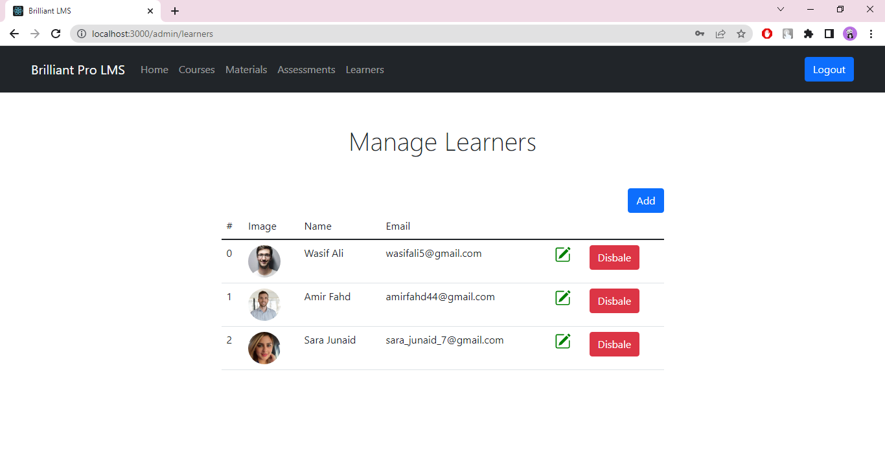

# Learning Management System
### Tools and Technologies used:
- MERN Stack (MongoDB, Express JS, React Js, Node JS)
- Bootstrap
- Visual Studio Code
- Javascript libraries: jsonwebtoken, bycrypt, express-fileupload, randomstring, jspdf

### Features:

Admin:
- Add, edit and view courses.
- Upload course material in formats: pdf, ppt, pptx and mp4.
- Add, edit, delete and view learners
- Add assessments with multiple choice questions.
- Add course materials and assessments.
- View overall statistics on dashboard.

Learner:
- View all the active courses.
- View enrolled courses. Unenroll from a course.
- View course materials and attempt assessments.
- View certificates for completed courses.

  

  

  

